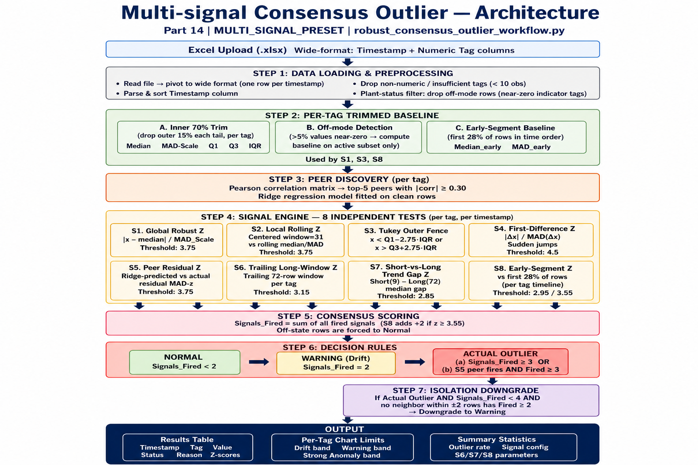

# Multi-signal Consensus Outlier Detection
### Feature: Part 14 — `MULTI_SIGNAL_PRESET`
**Module:** `services/robust_consensus_outlier_workflow.py`  
**Route:** `POST /part14/multi-signal-consensus-outlier`  
**UI Tab:** "Multi-signal consensus outlier" (sidebar)

---

## 1. Architecture Overview



The feature is a layered pipeline. Raw time-series data enters at the top, is cleaned and normalised, then processed by up to **8 independent statistical signals** per (Tag × Timestamp) pair. A consensus voting rule counts how many signals fired for that point; the majority determines the final label. A post-classification isolation check prevents lone-spike false positives.

---

## 2. Functional Overview

| Aspect | Details |
|---|---|
| **Goal** | High precision (very few false positives) while still catching gradual ramps, sustained level-shifts, and value plateaus that pure spike-detectors miss |
| **Granularity** | Every (tag, timestamp) pair is classified independently |
| **Output labels** | `Normal`, `Warning` (Drift), `Actual Outlier` (Strong Anomaly) |
| **Preset used** | `MULTI_SIGNAL_PRESET` — slightly relaxed thresholds vs the strict `part13` preset, plus three extra signals (S6 / S7 / S8) |
| **Per-tag treatment** | Each tag's baseline, trimming, and signal parameters are computed independently |

---

## 3. Step-by-Step Logic

### Step 1 — Data Loading & Preprocessing

1. The uploaded `.xlsx` file is read and pivoted to **wide format**: one row per timestamp, one column per tag.
2. The `Timestamp` column is detected automatically, parsed, and the rows sorted chronologically.
3. Non-numeric or near-empty columns (< 10 valid observations) are dropped.
4. **Plant-status / shutdown filter** — if the user designated any tags as "shutdown indicators", rows where those tags show near-zero values are removed entirely before analysis. This prevents off-mode periods from appearing as anomalies.

---

### Step 2 — Per-Tag Trimmed Baseline

For every tag the system builds robust statistics that represent **typical operating conditions**:

| Statistic | How computed |
|---|---|
| `Median` | Median of the inner 70% of values (outer 15% trimmed from each tail) |
| `MAD_Scale` | `1.4826 × MAD` on the inner-trimmed series |
| `Q1`, `Q3`, `IQR` | Quartiles of the inner-trimmed series |
| `Diff_Scale` | `1.4826 × MAD` of first-differences, also trimmed |
| `Off_Floor` | Absolute floor below which a value counts as "off" |
| `Off_Mode` | True if ≥ 5 % of values are near-zero (bimodal tag, e.g. a valve) |

**Why trim?**  
A tag that spent months at a high regime will have inflated Q3 and IQR. Without trimming, the Tukey upper fence becomes far too high and real outliers around 1560 look "within limits". Trimming 15 % from each tail anchors the baseline to the dense, typical operating band.

Off-mode tags (e.g. a pump discharge that is zero 60 % of the time) have their baseline computed on the active subset only.

---

### Step 3 — Peer Discovery (for Signal S5)

For each tag, the system finds up to **5 most-correlated peer tags** (|Pearson r| ≥ 0.30) using only rows where both tags have valid values. A **ridge regression model** is fitted on "clean" rows (those not already extreme by S1), mapping the peer values to the target tag. The fitted model is used in Step 4 to generate peer-predicted values and residuals.

---

### Step 4 — Signal Engine (8 Independent Tests)

All signals are computed per-tag, per-timestamp. Off-state rows cannot fire any signal.

#### S1 — Global Robust Z
```
Z_Global = (x − Median) / MAD_Scale
Fires if |Z_Global| >= 3.75
```
Detects points that are far from the tag's global typical level. The trimmed baseline prevents long high-regime history from pulling `Median` too high.

---

#### S2 — Local Rolling Z
```
Z_Local = (x − rolling_median) / rolling_MAD_scale
Window: 31 rows centered; min_periods = 11
Fires if |Z_Local| >= 3.75
```
Detects local spikes relative to the surrounding 30-row window. Catches short-lived deviations that the global median might normalise.

---

#### S3 — Tukey Outer Fence
```
Fence_Lower = Q1 − 2.75 × IQR
Fence_Upper = Q3 + 2.75 × IQR
Fires if x < Fence_Lower OR x > Fence_Upper
```
Classic non-parametric outlier fence. Uses k = 2.75 (between standard outer fence k = 3 and inner fence k = 1.5) for balance. Based on the trimmed IQR.

---

#### S4 — First-Difference Z (Sudden Jump)
```
Z_Diff = (x[t] − x[t-1]) / Diff_Scale
Fires if |Z_Diff| >= 4.5
```
Detects abrupt single-step changes (instrument faults, valve slams). The difference series is also trimmed before computing its MAD scale.

---

#### S5 — Peer-Regression Residual Z
```
Predicted = Ridge_Regression(peers)
Residual = x − Predicted
Z_Peer = Residual / MAD(residuals on clean rows)
Fires if |Z_Peer| >= 3.75
```
Detects values that are anomalous *relative to what correlated peers predict*. This cross-tag signal is the most powerful evidence because it cannot be explained by shared process excursions. When S5 fires together with ≥ 2 other signals, it acts as an Actual-Outlier gate even without reaching the strict count.

---

#### S6 — Trailing Long-Window Robust Z *(Part14 only)*
```
Z_LongRegime = (x − trailing_median(L=72 rows)) / (1.4826 × trailing_MAD)
Fires if |Z_LongRegime| >= 3.15
```
Compares each point against the **median of the preceding 72 rows** for that tag. This is a per-tag, trailing (causal) window — it has not yet adapted to a new level, so a gradual ramp that looks normal globally will still be anomalous relative to recent history. Window of 72 rows ≈ 3 days of hourly data.

---

#### S7 — Short-vs-Long Trend Gap Z *(Part14 only)*
```
Gap = short_trailing_median(9 rows) − long_trailing_median(72 rows)
Z_TrendGap = Gap / MAD_scale(Gap over full tag history)
Fires if |Z_TrendGap| >= 2.85
```
Measures whether the **recent short-term level has persistently separated** from the long-term level. A sustained upward ramp causes the short-term median to drift above the long-term median, producing a large positive gap z-score. This catches gradual monotone trends that individual point tests miss.

---

#### S8 — Early-Segment Robust Z *(Part14 only)*
```
Early baseline = Median and MAD of the first 28% of rows (time-ordered, per tag)
Z_EarlySegment = (x − Median_early) / MAD_Scale_early
Fires (standard) if |Z_EarlySegment| >= 2.95
Fires (strong)   if |Z_EarlySegment| >= 3.55  → adds +2 to Signals_Fired
```
The earliest rows represent the tag's **commissioning / initial operating band**. A sustained plateau or level-shift that developed after startup will have a high early-segment z-score even if later history normalised it. The "strong" threshold (3.55) gives a **double fire** — one extra point in the consensus count — so a very strong early-segment deviation can push a point from Normal to Warning, or Warning to Actual Outlier, without requiring other signals.

---

### Step 5 — Consensus Scoring

For each (tag, timestamp) pair:

```
Signals_Fired = S1 + S2 + S3 + S4 + S5 + S6 + S7 + S8 + S8_strong
```

- `S8_strong` adds an extra +1 when `|Z_EarlySegment| >= 3.55` (so S8 can contribute a maximum of 2).
- Off-state rows have `Signals_Fired` set to 0 (forced Normal).
- `Signals_Testable` counts how many signals had valid statistics for that row (denominator context).

---

### Step 6 — Classification (Decision Rules)

| Condition | Label |
|---|---|
| S5 peer fires **AND** `Signals_Fired >= 3` | **Actual Outlier** |
| `Signals_Fired >= 3` (any combination) | **Actual Outlier** |
| `Signals_Fired == 2` | **Warning** (Drift) |
| `Signals_Fired < 2` | **Normal** |
| Off-state row (any above) | **Normal** |

> **Why the peer gate?**  
> S5 is the hardest signal to fake — it requires the tag to deviate from what physics-correlated neighbours predict. When S5 fires alongside even 2 other signals (total ≥ 3), that constitutes a very strong consensus.

---

### Step 7 — Isolation Downgrade

After classification, **lone Actual Outlier points** are re-examined:

```
If:  Final_Class == "Actual Outlier"
AND: Signals_Fired < 4           (not overwhelming evidence)
AND: no row within ±2 timestamps has Signals_Fired >= 2
THEN: downgrade to "Warning"
```

This prevents single-point instrument blips from being escalated to the highest severity. A true process excursion typically affects several consecutive rows; an isolated spike is more likely measurement noise.

---

### Step 8 — Output Generation

1. **Reason string** — each classified row gets a human-readable explanation, e.g.:  
   `global z=4.12>=3.8; early-segment z=3.61>=2.95; outside IQR fence  (signals=3)`

2. **Plot classification** — internal labels are mapped to chart categories:
   - `Actual Outlier` → `Strong Anomaly`
   - `Warning` → `Drift`
   - `Normal` → `Normal`

3. **Per-tag chart limits** — drift band, warning band, strong-anomaly threshold are derived from trimmed statistics and fences.

4. **Summary statistics** — overall counts, signal thresholds, and all S6/S7/S8 parameters are included in the results summary table.

5. **Monthly pages** — results are grouped by tag and month for browseable detail views.

---

## 4. Configuration Reference (MULTI_SIGNAL_PRESET)

| Parameter | Value | Role |
|---|---|---|
| `k_global_robust_z` | 3.75 | S1 threshold |
| `k_local_rolling_z` | 3.75 | S2 threshold |
| `k_iqr_fence` | 2.75 | S3 Tukey k |
| `k_diff_z` | 4.5 | S4 threshold |
| `k_peer_residual_z` | 3.75 | S5 threshold |
| `min_peer_abs_corr` | 0.30 | Minimum |r| for a peer to be included |
| `n_actual_strict` | 3 | Minimum fires for Actual Outlier (without peer gate) |
| `baseline_trim_each_tail` | 0.15 | Trim 15% from each tail for per-tag level baseline |
| `long_regime_window` | 72 | S6 trailing window (rows) |
| `long_regime_min_periods` | 24 | S6 minimum valid rows in window |
| `k_long_regime_z` | 3.15 | S6 threshold |
| `short_regime_window` | 9 | S7 short window |
| `short_regime_min_periods` | 4 | S7 minimum valid rows |
| `k_trend_gap_z` | 2.85 | S7 threshold |
| `early_segment_fraction` | 0.28 | First 28% of rows used as S8 baseline |
| `early_segment_min_points` | 40 | Minimum rows needed for S8 early baseline |
| `k_early_segment_z` | 2.95 | S8 standard fire threshold |
| `k_early_segment_strong` | 3.55 | S8 strong fire threshold (+2 to Signals_Fired) |

---

## 5. Key Design Decisions

### Why per-tag trimmed baselines?
One tag like `KT1301 CHEST PRESSURE` may spend months at an elevated regime (e.g. 1600–1700), inflating the global Q3 and IQR. Without trimming, the Tukey upper fence climbs to ~1680, making a value of 1560 look normal. With 15% tail-trimming the fence reflects the dense operating band (~1450–1570), so 1560 correctly appears on the boundary.

### Why an early-segment baseline (S8)?
When a process gradually drifts from its initial commissioning state, global statistics adapt over time and the drift looks "normal" by mid-history. S8 freezes the baseline at the earliest 28% of the tag's timeline. Any later sustained plateau above the early operating band accumulates S8 fires, surfacing the long-term drift without affecting tags that legitimately operate at a different level from day one.

### Why is S8 allowed to fire twice?
A rising trend that crosses the early-segment threshold modestly (e.g. z = 2.97) would normally earn only 1 fire. A trend that is strongly outside the early band (z = 3.55+) deserves more weight — the double fire ensures it reaches "Warning" (2 fires) or contributes meaningfully to an "Actual Outlier" verdict (3 fires total) without requiring additional signals.

### Why is isolation downgrade needed?
Random instrument spikes produce a single-row deviation with perhaps 2–3 signals, but the surrounding rows are perfectly normal. Real process anomalies persist across multiple consecutive timestamps. The isolation check preserves high precision by demoting lone spikes; the `isolation_override_consensus` threshold (4 signals) ensures that only the most overwhelming single-point evidence is exempt from downgrade.

---

## 6. Output Columns Reference

| Column | Description |
|---|---|
| `Timestamp` | Original timestamp |
| `Tag` | Tag name |
| `Actual_Value` | Measured value |
| `Predicted_Value` | Ridge-regression peer prediction (or baseline median if no peers) |
| `Baseline_Center` | Trimmed robust median for this tag |
| `Baseline_Scale` | Trimmed MAD scale (1.4826 × MAD) |
| `Z_Global` | S1 z-score |
| `Z_Local` | S2 z-score |
| `Z_Diff` | S4 z-score |
| `Z_Peer` | S5 z-score |
| `Z_LongRegime` | S6 z-score |
| `Z_TrendGap` | S7 z-score |
| `Z_EarlySegment` | S8 z-score |
| `Outside_Fence` | True if S3 (Tukey) fired |
| `Fence_Lower` / `Fence_Upper` | S3 fence values |
| `Signals_Fired` | Total consensus count (including S8 double-fire) |
| `Signals_Testable` | How many signals had valid stats for this row |
| `S5_Peer_Fired` | True if peer-regression signal fired |
| `Off_State` | True if row is in off/shutdown mode |
| `Direction` | High or Low relative to baseline median |
| `Final_Class` | Raw classification before plot mapping |
| `Final_Status` | Same as Final_Class |
| `Reason` | Human-readable explanation of which signals fired |

---

## 7. File & Code Map

```
D:\Anomaly_Detection\
│
├── services\
│   └── robust_consensus_outlier_workflow.py   ← Core logic (CONFIG, MULTI_SIGNAL_PRESET,
│                                                  helper functions, run_robust_consensus_outlier_ui)
│
├── routes\
│   └── dashboard.py                           ← Flask route /part14/multi-signal-consensus-outlier
│                                                  imports MULTI_SIGNAL_PRESET, calls
│                                                  run_robust_consensus_outlier_ui with preset
│
├── templates\
│   ├── index.html                             ← Upload form for part14 (id="part14OutlierForm")
│   ├── results.html                           ← Results display for active_tab == "part14"
│   └── dashboard.html                         ← Sidebar link for part14
│
└── Multi_Signal_Consensus_Outlier_Documentation.md   ← This file
```

---

## 8. Worked Example — KT1301 CHEST PRESSURE

**Problem:** Tag historically spent a period at ~1620–1680 (a high-pressure regime). Global trimmed median was around 1490, but the IQR fence upper bound was still ~1600–1650, meaning the value of 1560 (occurring from April 2024 onward in a rising trend) appeared "within limits".

**How MULTI_SIGNAL_PRESET catches it:**

1. **S8 early-segment baseline:** The first 28% of the tag's rows are from early operation, where the tag was around 1400–1480. `Median_early ≈ 1450`, `MAD_Scale_early ≈ 50`. A value of 1560 gives `Z_EarlySegment ≈ 2.2` (mild) while the peak at 1580+ gives `Z ≈ 2.6`, crossing the standard S8 threshold (2.95) and sometimes the strong threshold (3.55).

2. **S6 trailing long-window:** As the tag ramps upward from April 2024, each new point is measured against the median of the preceding 72 rows (which is still at the pre-ramp level). The ramp produces `Z_LongRegime > 3.15`, firing S6.

3. **S7 trend-gap:** The 9-row short median rises faster than the 72-row long median, creating a growing positive gap. When the gap exceeds 2.85 MADs of its own distribution, S7 fires.

4. **Combined:** S6 + S7 (+ possibly S8) = 2–3 fires → "Warning" or "Actual Outlier", with `strong_anomaly_upper_limit` reduced to ~1599 instead of ~1680.

---

*Generated: May 2026 | Process Intelligence Application*
